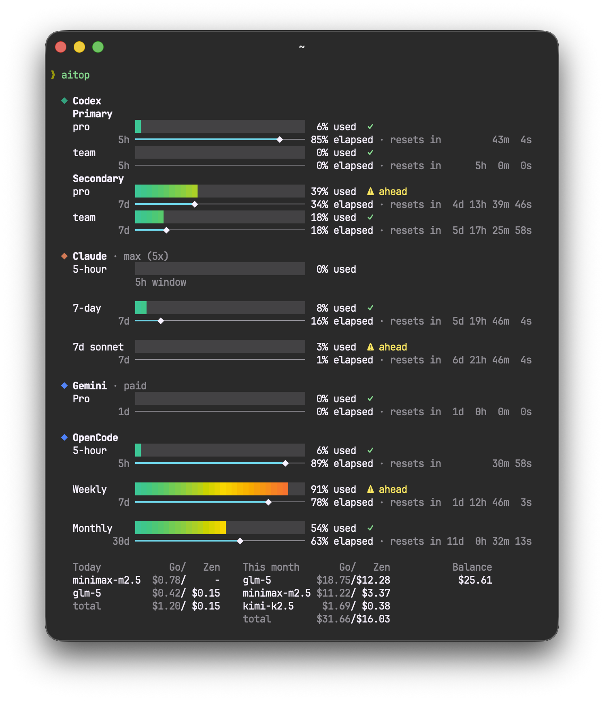

# aitop

Terminal dashboard that shows your AI coding assistant usage at a glance. Runs each provider in parallel and renders a unified view with color-coded usage bars, pacing indicators, and reset countdowns.

## Screenshot



## Supported Providers

| Provider | Script | Auth Source |
|---|---|---|
| Claude Code | `aitop-claude` | macOS Keychain (Claude Code OAuth) |
| Codex | `aitop-codex` | `~/.local/share/opencode/auth.json` |
| Gemini CLI | `aitop-gemini` | `~/.gemini/oauth_creds.json` |
| OpenCode | `aitop-opencode` | Cookie file or `AITOP_OPENCODE_COOKIE` env var |

## Requirements

- Bash 4+
- `jq`
- `curl`
- `sqlite3` (for Claude caching and Codex pool accounts)
- `python3` (for Gemini token refresh and OpenCode parsing)
- macOS (`security` command for Claude Keychain access, BSD `date -jf` for timestamp parsing)

## Usage

Run all providers:

```bash
aitop
```

Run a single provider:

```bash
aitop-claude
aitop-codex
aitop-gemini
aitop-opencode
```

Each script accepts `--help` for provider-specific options.

### Provider-Specific Options

**aitop-claude**

```
--no-cache    Bypass the response cache (default TTL: 5 min)
```

Cache TTL is configurable via `CLAUDE_USAGE_CACHE_TTL` (seconds). Set `CLAUDE_USAGE_CACHE=0` to disable caching entirely.

**aitop-opencode**

Requires a browser auth cookie. Set it via:

1. File: `~/.config/aitop-opencode/cookie`
2. Environment: `AITOP_OPENCODE_COOKIE`

Set `AITOP_OPENCODE_WORKSPACE_ID` to skip dynamic workspace discovery.

## Output

Each provider renders a section with:

- **Usage bar** — gradient from teal to yellow to red as usage increases
- **Pace indicator** — `✓` on track, `⚠ ahead` of pace, `■ full` at capacity
- **Time bar** — elapsed portion of the current usage window
- **Reset countdown** — time remaining until the window resets

OpenCode additionally shows per-model cost breakdowns (today / this month) and Zen credit balance.

## Project Structure

```
aitop                 # Aggregator — runs all providers in parallel
aitop-claude          # Claude Code usage via Anthropic OAuth API
aitop-codex           # Codex usage via OpenAI/ChatGPT backend
aitop-gemini          # Gemini CLI usage via Google Cloud Code Assist API
aitop-opencode        # OpenCode usage via opencode.ai server functions
lib/render.bash       # Shared terminal rendering (bars, colors, formatting)
docs/                 # Screenshots and documentation assets
tests/                # Contract tests per provider
```

## Tests

Run the contract test for a specific provider:

```bash
bash tests/aitop-claude-contract.sh
bash tests/aitop-codex-contract.sh
bash tests/aitop-gemini-contract.sh
bash tests/aitop-opencode-contract.sh
```

## License

See repository for license details.
